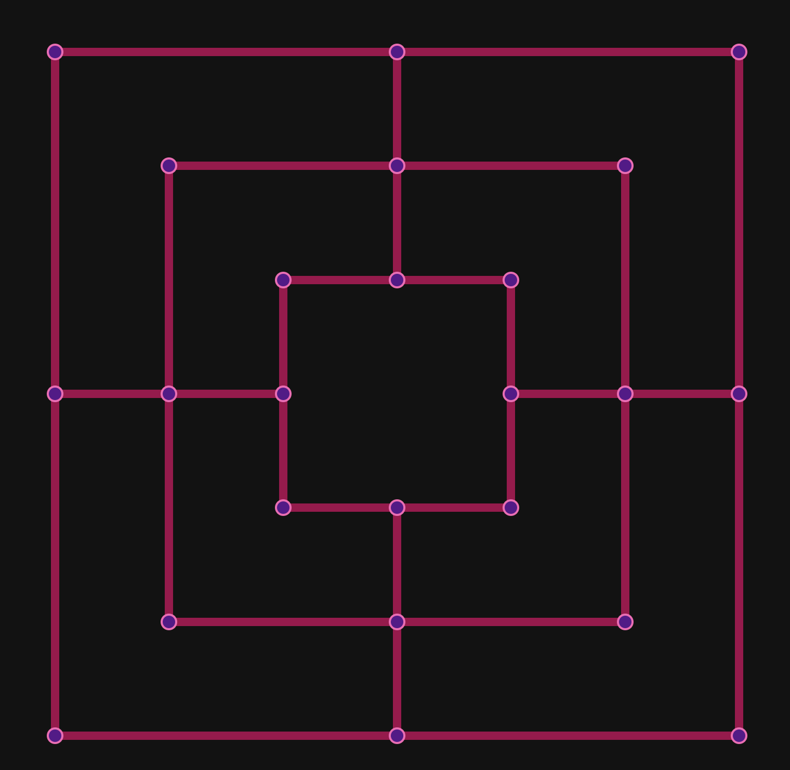
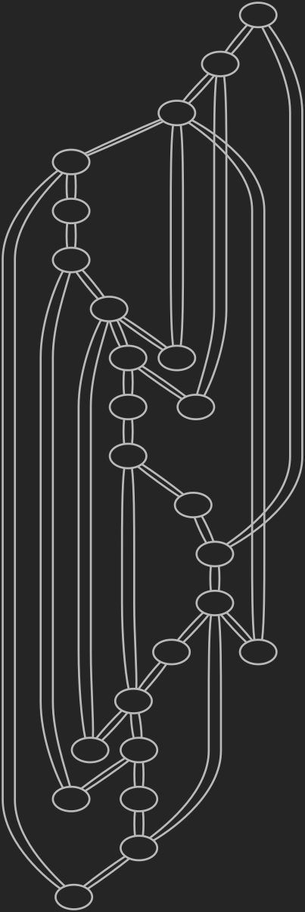

# Nine Peer's Morris

A WebRTC P2P implemetation of the medieval classic board game
[Nine Men's Morris](https://en.wikipedia.org/wiki/Nine_men's_morris)

Vist the live version here and play against a friend:
[Nine Peer's Morris](http://zeyus.com/nine-peers-morris/)

## Implementation

The game uses serverless WebRTC connections to connect two players directly in the browser, using
[SvelteKit](https://kit.svelte.dev/) as the web framework and
[PeerJS](https://peerjs.com/) as the WebRTC abstraction library. While the game requires a signaling server / broker
for the initial connection handshake, all game data is exchanged directly between the two players' browsers.

## Game Board

here's the board so far, with pieces placed from the board, player and graph, implemented in HTML/CSS:

And here's what the game board looks like represented as a graph:

