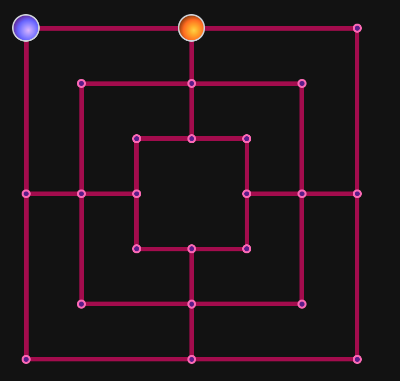

# Nine Peer's Morris

A WebRTC P2P implemetation of the medieval classic board game
[Nine Men's Morris](https://en.wikipedia.org/wiki/Nine_men's_morris)

WIP. When ready it will be deployed as a serverless web app.

here's the board so far, with pieces placed from the board, player and graph, implemented in HTML/CSS:

And here's what the game board looks like represented as a graph:

